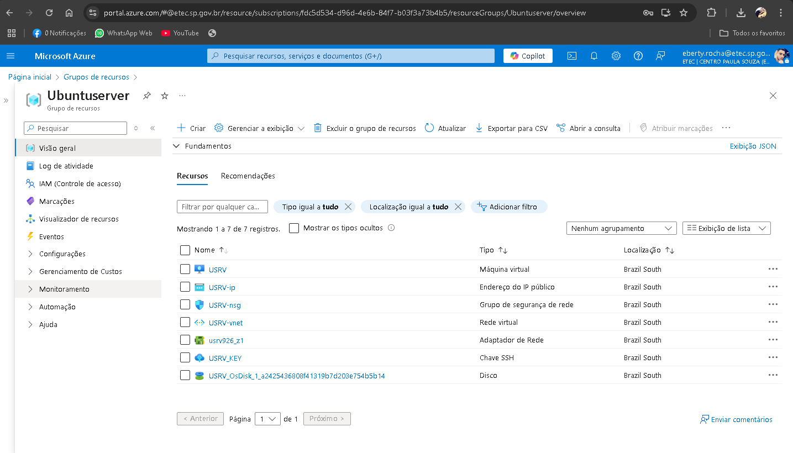

# Ubuntu-Server-Azure

# Azure Ubuntu Server Setup Guide

Este repositório fornece um guia passo a passo para configurar e iniciar uma máquina virtual Ubuntu Server na plataforma Azure, incluindo as configurações iniciais e acesso via SSH.

## Descrição

Este tutorial abrange o processo de criação de uma VM no Azure, configuração do Ubuntu Server, ajustes de idioma, configuração do SSH e a instalação das ferramentas mais comuns para ambientes de servidor. 

Além disso, será mostrado como configurar a chave SSH para garantir um acesso seguro à sua máquina na nuvem. Você encontrará dicas para personalizar sua instalação e otimizar seu ambiente Ubuntu no Azure.

## Imagem de Referência

## Pré-requisitos

- Conta ativa no [Microsoft Azure](https://azure.microsoft.com/)
- Acesso à [Azure CLI](https://learn.microsoft.com/en-us/cli/azure/install-azure-cli)
- Acesso ao PowerShell ou terminal Linux
- Arquivo da chave privada SSH (.pem) para acesso seguro à VM
  

 Este é um guia inicial para configurar seu servidor Ubuntu na Azure!
